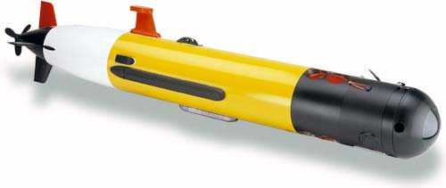
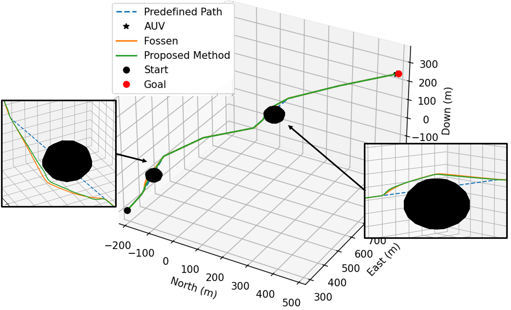

# AUV Path Tracking and Obstacle Avoidance
AUV Simulation for Path Tracking and Obstacle Avoidance
This repository contains a simulation framework for an **Autonomous Underwater Vehicle (AUV)** performing path tracking and obstacle avoidance. The implementation uses MATLAB for the main simulation and Python for data visualization.   
<p align="center">
  
</p>

## Project Structure
- ```data/```: Output data generated by the simulation.
- ```estimator/```: Slip angle observer functions.
- ```gnc/```: Guidance, navigation, and control scripts.
- ```lib/```: Supporting utility functions.
- ```model/```: AUV dynamics and simulation models.
- ```main.m```: Main entry point for running the simulation (MATLAB).
- ```plot_data.py```: Visualization script (Python).

## How to Use
### 1. Run the Simulation (MATLAB)
Run the following script from MATLAB to execute the simulation: ```main.m```.    
Simulation results will be saved automatically to the ```data/``` folder in .mat file.

### 2. Visualize the Results (Python)
To visualize the simulation output, run the Python script: ```plot_data.py```  
<table>
  <tr>
    <td align="center">
      
      <br/>Path Tracking & Obstacle Avoidance
    </td>
    <td align="center">
      
      <br/>Threat Function of 2 Methods
    </td>
  </tr>
</table>
For a more detailed explanation of the scripts, modules, and how this simulation works, please refer to the 
[manual book](https://drive.google.com/drive folders/1r0Oy2otmFsFJCPTh0_OJNiTHkJhXektt?usp=sharing). 

## Dependencies
You need to install:
1. MATLAB
2. Python 3.X with NumPy, matplotlib

Special thanks to the open-source community for sharing knowledge and tools that made this project possible.  
Make sure Python and the required packages are installed (see Dependencies below).

## Acknowledgements
Some parts of this project are adapted or based on publicly available code from other authors. I would like to acknowledge and give credit to the original creators:
- Marine System and Simulator (MSS) by [Thor I. Fossen](https://github.com/cybergalactic/MSS).

## Contact
If you have any questions, suggestions, or would like to collaborate, feel free to:
- Open an issue.
- Or contact me at: [Rifqy Risqullah](risqullah.rifqy19@gmail.com).
